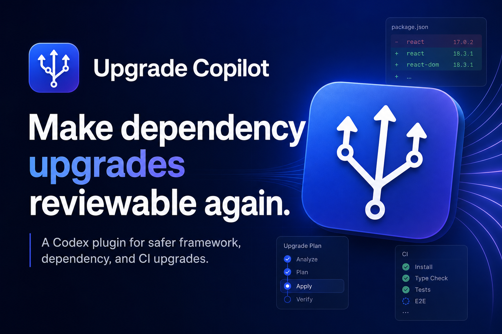
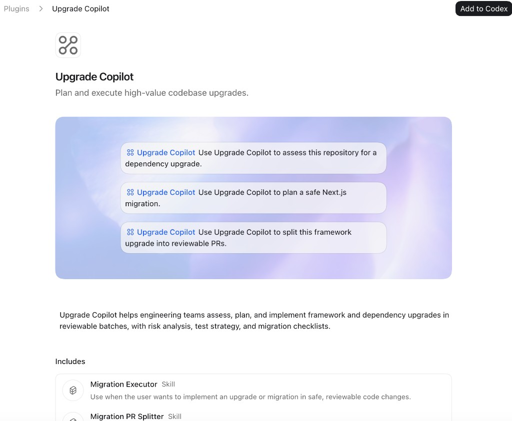

# Upgrade Copilot

**Upgrade Copilot is a Codex plugin for dependency and framework upgrades that should not become one giant risky PR.**

[Install page](https://chaoyue0307.github.io/upgrade-copilot/) ·
[Premium waitlist](https://github.com/ChaoYue0307/upgrade-copilot/issues/new?template=waitlist.yml) ·
[Risk report prototype](https://chaoyue0307.github.io/upgrade-copilot/risk-report.html) ·
[Demo video](https://chaoyue0307.github.io/upgrade-copilot/assets/upgrade-copilot-demo.mp4) ·
[Roadmap](docs/roadmap.md) ·
[Case studies](https://chaoyue0307.github.io/upgrade-copilot/#case-study) ·
[Prompt library](https://chaoyue0307.github.io/upgrade-copilot/prompts.html)



## Why This Exists

Dependency upgrades look simple until they break CI, auth flows, build tooling, or production behavior. Upgrade Copilot gives Codex a focused operating model for this work:

- Find the safest dependency upgrades first.
- Map upstream breaking changes to local files and configs.
- Diagnose upgrade-related test, type, lint, and build failures.
- Split migrations into small PRs with validation and rollback notes.
- Turn recurring upgrade debt into a team backlog.

The goal is to make upgrades reviewable, testable, and easier to fund.



## Install In Codex

Open Codex Plugins, choose **Add marketplace**, and enter:

```text
Source: ChaoYue0307/upgrade-copilot
Git ref: main
Sparse paths:
```

Leave `Sparse paths` empty. After the marketplace loads, open **Upgrade Copilot** and choose **Add to Codex**.

This is a public custom marketplace source. It is not an official OpenAI marketplace listing.

## Try These Prompts

```text
Use Upgrade Copilot to find the safest dependency upgrades in this repo.
Use Upgrade Copilot to map breaking changes for upgrading Next.js.
Use Upgrade Copilot to diagnose why CI started failing after this dependency update.
Use Upgrade Copilot to split this migration into small PRs with validation commands.
Use Upgrade Copilot to build a team upgrade backlog for this repository.
```

## Included Skills

| Skill | What It Helps With |
| --- | --- |
| `dependency-upgrade-triage` | Prioritize outdated, vulnerable, risky, and safe dependency updates. |
| `breaking-change-mapper` | Map migration guides and release notes to local code, configs, and symbols. |
| `upgrade-ci-rescue` | Diagnose upgrade-related CI, build, test, lint, and type failures. |
| `upgrade-assessment` | Audit readiness before framework, runtime, dependency, or platform migrations. |
| `migration-executor` | Implement upgrade batches with focused validation. |
| `migration-pr-splitter` | Split migration work into reviewable PRs with rollback notes. |
| `team-upgrade-program` | Create an upgrade backlog and 30/60/90-day roadmap. |

## Demo Case Studies

I browsed real public repos and wrote Upgrade Copilot-style assessments:

- [`Next.js Starter Upgrade Triage`](https://chaoyue0307.github.io/upgrade-copilot/case-studies/nextjs-starter-upgrade-triage.html)
- [`React/Vite Starter Upgrade Triage`](https://chaoyue0307.github.io/upgrade-copilot/case-studies/react-vite-starter-upgrade-triage.html)
- [`Django Template Upgrade Triage`](https://chaoyue0307.github.io/upgrade-copilot/case-studies/django-template-upgrade-triage.html)

The case studies show how the plugin identifies major version gaps, risky migration areas, missing CI evidence, and safe PR sequences across frontend and backend stacks.

## Risk Report Prototype

Try the first premium prototype: [paste a public GitHub repo URL and generate an upgrade risk report](https://chaoyue0307.github.io/upgrade-copilot/risk-report.html). It is browser-only for now, supports shareable report URLs and Markdown downloads, and includes a waitlist form for future paid hosted scans, saved reports, GitHub automation, and team dashboards.

## Demo Video

Watch the real browser-recorded demo: [Upgrade Copilot risk report demo](https://chaoyue0307.github.io/upgrade-copilot/assets/upgrade-copilot-demo.mp4). It shows the live prototype scanning a public repo, rendering upgrade risk, exporting the report, and capturing premium interest.

## How It Compares

- **Dependabot/Renovate** open version bump PRs. Upgrade Copilot explains risk, groups upgrades, and proposes validation-backed PR batches.
- **Generic Codex prompting** can help if the user writes the right prompt. Upgrade Copilot loads the upgrade workflow every time.
- **Migration docs** describe upstream changes. Upgrade Copilot maps those changes to local files, configs, tests, and rollout risk.

## Prompt Library

Open the [prompt library](https://chaoyue0307.github.io/upgrade-copilot/prompts.html) for copy-paste prompts covering dependency triage, framework migrations, CI rescue, PR splitting, and team upgrade planning.

## FAQ, Privacy, And Terms

- [FAQ](docs/faq.md)
- [Privacy policy](docs/privacy.md)
- [Terms of service](docs/terms.md)
- [Launch post drafts](docs/launch-post.md)

## Product Direction

The free plugin is the distribution layer. The paid product can become a hosted upgrade service:

- GitHub repo scan and upgrade risk score.
- Curated breaking-change intelligence.
- Automated PR batches for safe upgrades.
- CI failure clustering after dependency updates.
- Team dashboard for upgrade backlog, ownership, and rollout status.

See `upgrade-copilot/docs/monetization.md` and `upgrade-copilot/.mcp.example.json` for the placeholder paid-service shape.

## Join The Premium Waitlist

Want hosted repo scans, upgrade risk reports, GitHub PR automation, or a team dashboard? [Open a waitlist request](https://github.com/ChaoYue0307/upgrade-copilot/issues/new?template=waitlist.yml).

## Repository Layout

```text
.agents/plugins/marketplace.json        # Codex custom marketplace manifest
upgrade-copilot/.codex-plugin/plugin.json
upgrade-copilot/skills/
docs/index.html                         # GitHub Pages landing page
docs/prompts.html
docs/risk-report.html
docs/faq.md
docs/privacy.md
docs/terms.md
docs/case-studies/
docs/roadmap.md
```
